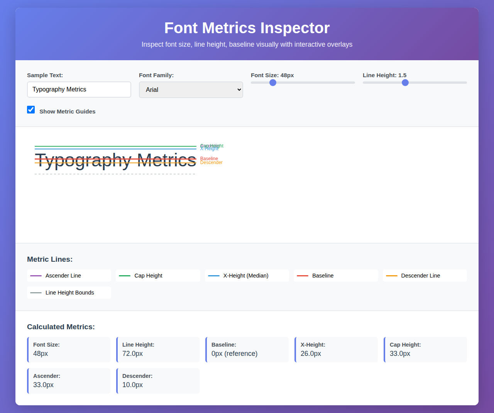
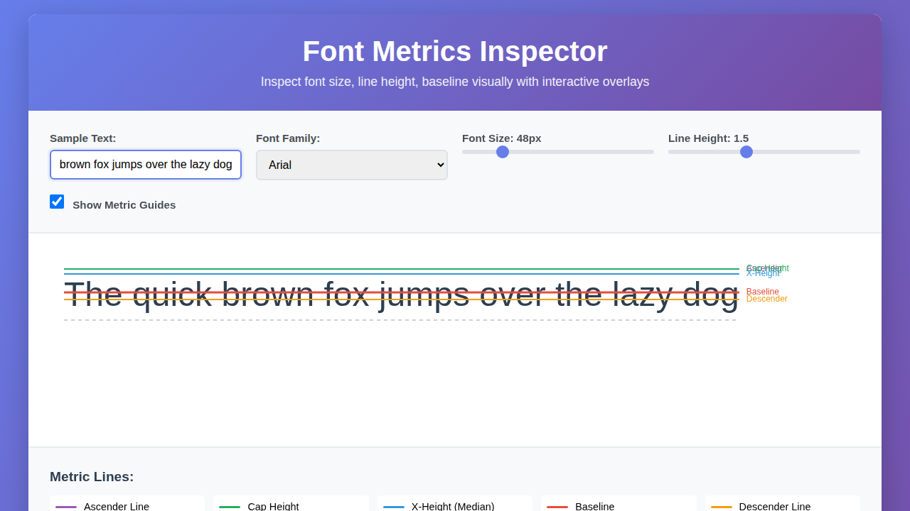
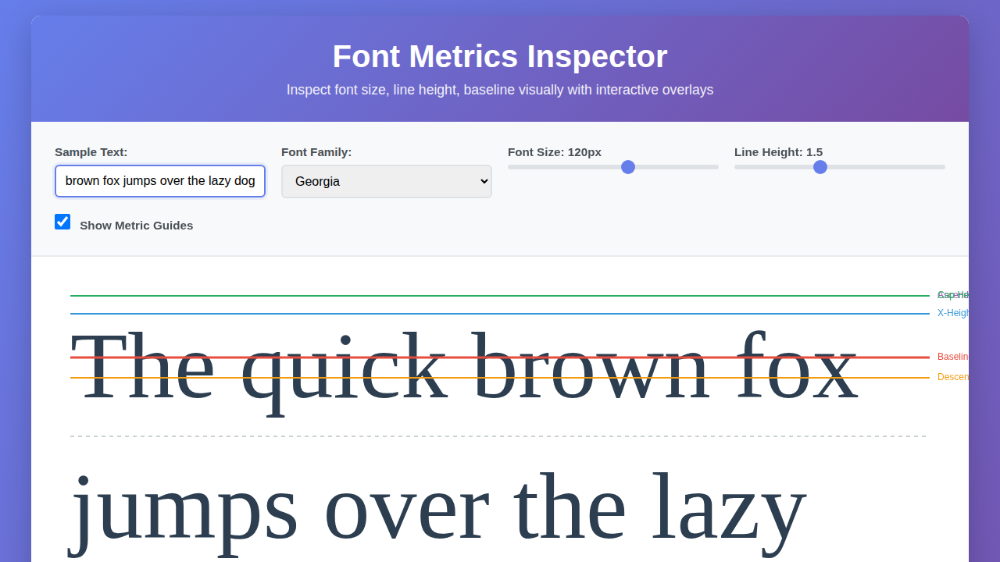

# Font Metrics Inspector

A visual typography inspection tool that overlays font metrics on sample text using Canvas guides. Perfect for designers and developers who need to understand and visualize font metrics.

## Features

- 📏 **Visual Metric Overlays**: See baseline, x-height, cap-height, ascender, and descender lines
- 🎨 **Interactive Controls**: Adjust font size, line height, and font family in real-time
- 📊 **Detailed Metrics**: View calculated measurements for all typography metrics
- 🎯 **Canvas-based Guides**: Precise visual guides drawn using HTML5 Canvas
- 💻 **Responsive Design**: Works on desktop and mobile devices

## Typography Metrics Visualized

- **Baseline** (Red): The line where most letters sit
- **X-Height** (Blue): The height of lowercase letters like 'x'
- **Cap Height** (Green): The height of capital letters
- **Ascender Line** (Purple): The top of tall letters like 'h', 'l', 'b'
- **Descender Line** (Orange): The bottom of letters like 'g', 'p', 'y'
- **Line Height Bounds** (Gray): The top and bottom boundaries of the line box

## Usage

1. Open `index.html` in a web browser
2. Enter your sample text in the input field
3. Select a font family from the dropdown
4. Adjust font size using the slider (12px - 200px)
5. Adjust line height using the slider (0.5 - 3.0)
6. Toggle metric guides on/off with the checkbox

## Files

- `index.html` - Main HTML structure
- `styles.css` - Styling and layout
- `font-metrics.js` - Core metrics calculation and Canvas drawing logic

## How It Works

The tool uses the Canvas API's `measureText()` method to extract precise font metrics:
- `actualBoundingBoxAscent` - Distance from baseline to top of text
- `actualBoundingBoxDescent` - Distance from baseline to bottom of text

These metrics are then visualized using Canvas lines overlaid on the text, providing a clear visual reference for typography analysis.

## Browser Compatibility

Works in all modern browsers that support:
- HTML5 Canvas API
- CSS Grid
- ES6 JavaScript

## License

MIT License - See LICENSE file for details
